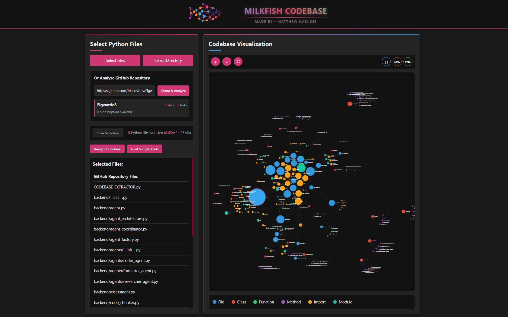

# Python Codebase Graph Visualizer 🔍

[](https://github.com/Maloskins)
[](LICENSE)
[](https://developer.mozilla.org/en-US/docs/Web/JavaScript)

A sleek, lightweight visualization tool that transforms your Python codebase into an interactive network graph, revealing connections between files, classes, methods, and functions. Perfect for identifying "floating nodes" – forgotten or unrealized components in your projects.




## 🚀 Features

- **Holistic Code Analysis**: See your entire codebase as an interconnected network
- **Relationship Discovery**: Visualize how components connect and interact
- **Floating Node Detection**: Quickly identify unused or disconnected code
- **Responsive Design**: Works seamlessly on desktop and mobile devices
- **Lightweight**: No heavy dependencies or frameworks

## 🔧 Installation & Usage

1. **Clone the repository**
   ```bash
   git clone https://github.com/Maloskins/python-codebase-visualizer.git
   cd python-codebase-visualizer
   ```

2. **Start a local server**
   ```bash
   # Using Python's built-in HTTP server
   python -m http.server 8000
   ```

3. **Open in your browser**
   ```
   http://localhost:8000
   ```

4. **Analyze your codebase**
   - Click "Choose Directory" to select a directory of Python files
   - Or click "Load Sample Code" to see the visualizer in action with example files
   - Explore the generated graph, zoom in/out, and click on nodes to see detailed information

### Purpose

Developed by [me](https://maloskins.pages.dev/cv) during a PyGame project to identify forgotten components of the game, this tool emerged from my research in Geometric Neural Networks, wondering why graph networks were not used diagnostically or as ubiquitously as I would have anticipated. I needed a way to quality-check code from a more holistic perspective, identifying seeing relationships that aren't immediately obvious when looking at individual files. 

I am aware similar tools exist but they are often convoluted and dont have magenta highlights in their application 🤡.


## 💻 Technical Details

- **Front-end**: HTML5, CSS3, and vanilla JavaScript (ES6+)
- **Visualization**: D3.js for the force-directed graph
- **Parser**: Custom JavaScript parser for Python code analysis
- **Responsive Design**: Works on devices of all sizes
- **No Backend Required**: Runs entirely in the browser

## 🤝 Contribute

Contributions, issues, and feature requests are welcome! Feel free to check the [issues page](https://github.com/Maloskins/python-codebase-visualizer/issues) or contact [me](https://maloskins.pages.dev/cv) directly.

## ☕ Support My Work

If you find this tool useful, consider buying me a coffee (or a coke zero, Coke, sponsor me or something idk):

[](https://www.buymeacoffee.com/maloskins)

I will be working on expanding the utility for different languages and allow it to automatically clone and scan repos. I have been adding functionality and will be hosting this on CF soon.


This project is [MIT](LICENSE) licensed.

---

Created with AI and Stupidity by [Matthew Haskins](https://github.com/Maloskins)