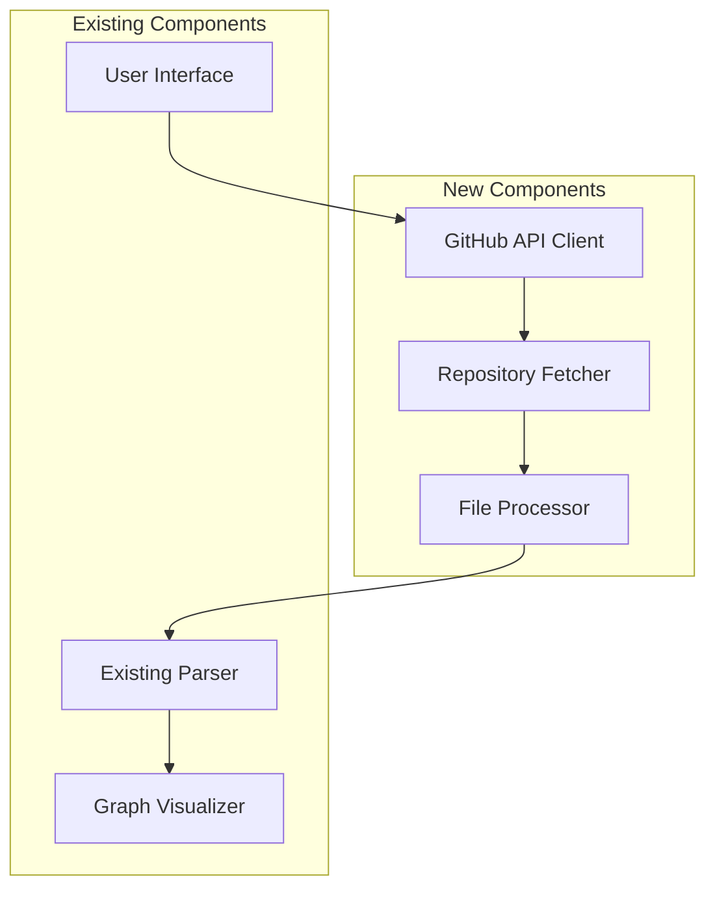
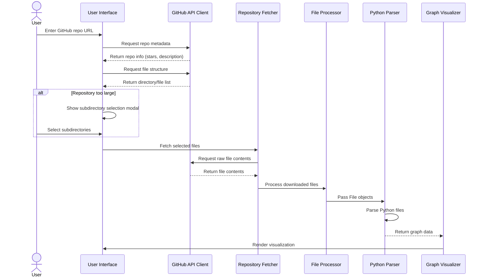

# GitHub Repository Integration Architecture Plan

## 1. Overview

The plan is to enhance the existing browser-based MilkFish Visualizations to allow users to input a GitHub repository URL, fetch the repository contents, and analyze the Python files without requiring a backend server. We'll focus on public repositories initially and leverage the existing size limiting functionality.

## 2. Architecture Design

### High-Level Architecture

### Component Breakdown

#### 2.1 User Interface Enhancements
- Add a new input section for GitHub repository URL
- Add a "Clone & Analyze" button
- Add repository metadata display (stars, forks, description)
- Add loading indicators for repository fetching progress

#### 2.2 GitHub API Client
- Handle GitHub API requests to fetch repository metadata
- Fetch repository structure (directories and files)
- Handle API rate limiting and errors

#### 2.3 Repository Fetcher
- Download repository files using GitHub's raw content URLs
- Track download progress and file sizes
- Implement size and file count limits (reusing existing constants)
- Support subdirectory selection for large repositories

#### 2.4 File Processor
- Convert downloaded files into File objects compatible with the existing parser
- Maintain directory structure information
- Filter for Python files only

## 3. Detailed Workflow

## 4. Implementation Details

### 4.1 GitHub API Integration

We'll use the GitHub REST API to fetch repository information and file contents:

1. **Repository Metadata**: `https://api.github.com/repos/{owner}/{repo}`
2. **Repository Contents**: `https://api.github.com/repos/{owner}/{repo}/contents/{path}`
3. **Raw File Content**: `https://raw.githubusercontent.com/{owner}/{repo}/{branch}/{path}`

The implementation will handle:
- URL parsing to extract owner, repo, and branch information
- API rate limiting (60 requests/hour for unauthenticated requests)
- Error handling for invalid repositories or network issues

### 4.2 File Size Management

We'll reuse the existing size limiting functionality:
- MAX_FILE_COUNT = 300
- MAX_TOTAL_SIZE = 5MB

For repositories exceeding these limits, we'll:
1. Show the subdirectory selection modal (reusing existing UI)
2. Allow users to select specific subdirectories to analyze
3. Provide size information during the selection process

### 4.3 User Experience Enhancements

To provide a smooth user experience:
1. Show loading indicators during API requests and file downloads
2. Display repository information (stars, forks, description)
3. Show progress during file fetching and parsing
4. Provide clear error messages for API limits or invalid repositories

## 5. Technical Approach

### 5.1 Browser-Based Implementation

The implementation will use:
- Fetch API for GitHub API requests
- Blob and File APIs to create File objects from downloaded content
- Existing Pyodide integration for AST-based parsing

### 5.2 Code Organization

New JavaScript modules:
1. `js/github.js` - GitHub API client and repository fetching logic
2. `js/file-processor.js` - Processing downloaded files into compatible format

UI enhancements in:
1. `index.html` - New GitHub repository input section
2. `css/styles.css` - Styling for new UI elements
3. `js/main.js` - Event handlers for GitHub integration

### 5.3 Error Handling and Security

The implementation will include:
1. Validation of GitHub URLs
2. Handling of API rate limits with clear user feedback
3. Error handling for network issues or invalid repositories
4. Size and count limits to prevent browser crashes

## 6. Potential Challenges and Solutions

| Challenge | Solution |
|-----------|----------|
| GitHub API rate limits | Implement caching and provide clear feedback when limits are reached |
| Large repositories | Reuse existing subdirectory selection UI to allow partial analysis |
| Network reliability | Implement retry logic and progress tracking |
| Browser memory constraints | Enforce size limits and implement progressive loading |
| Cross-origin restrictions | Use GitHub's CORS-enabled APIs (api.github.com and raw.githubusercontent.com) |

## 7. Implementation Phases

### Phase 1: Core GitHub Integration
1. Add GitHub URL input UI
2. Implement GitHub API client for repository metadata
3. Implement repository structure fetching
4. Add basic error handling

### Phase 2: File Processing
1. Implement file content downloading
2. Create File object conversion
3. Integrate with existing parser
4. Implement size limiting

### Phase 3: User Experience Enhancements
1. Add loading indicators and progress tracking
2. Enhance subdirectory selection for GitHub repositories
3. Add repository information display
4. Improve error messaging

## 8. Testing Strategy

1. Test with various public GitHub repositories of different sizes
2. Test with repositories containing different Python code structures
3. Test error handling with invalid URLs and API rate limiting
4. Test browser memory usage with large repositories